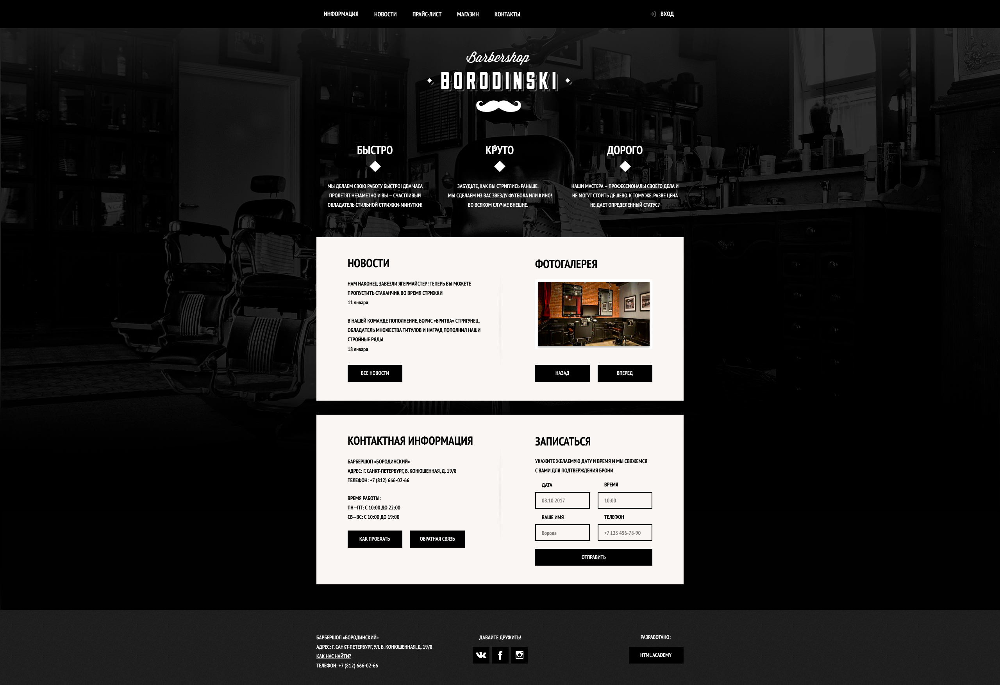
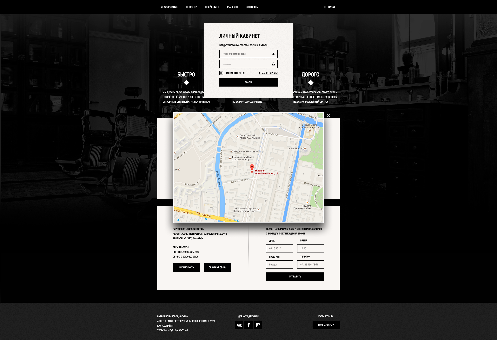
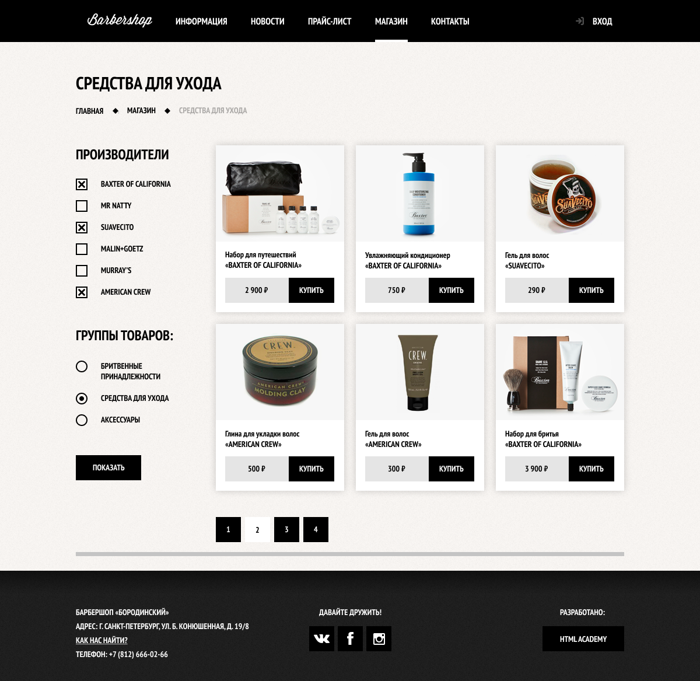
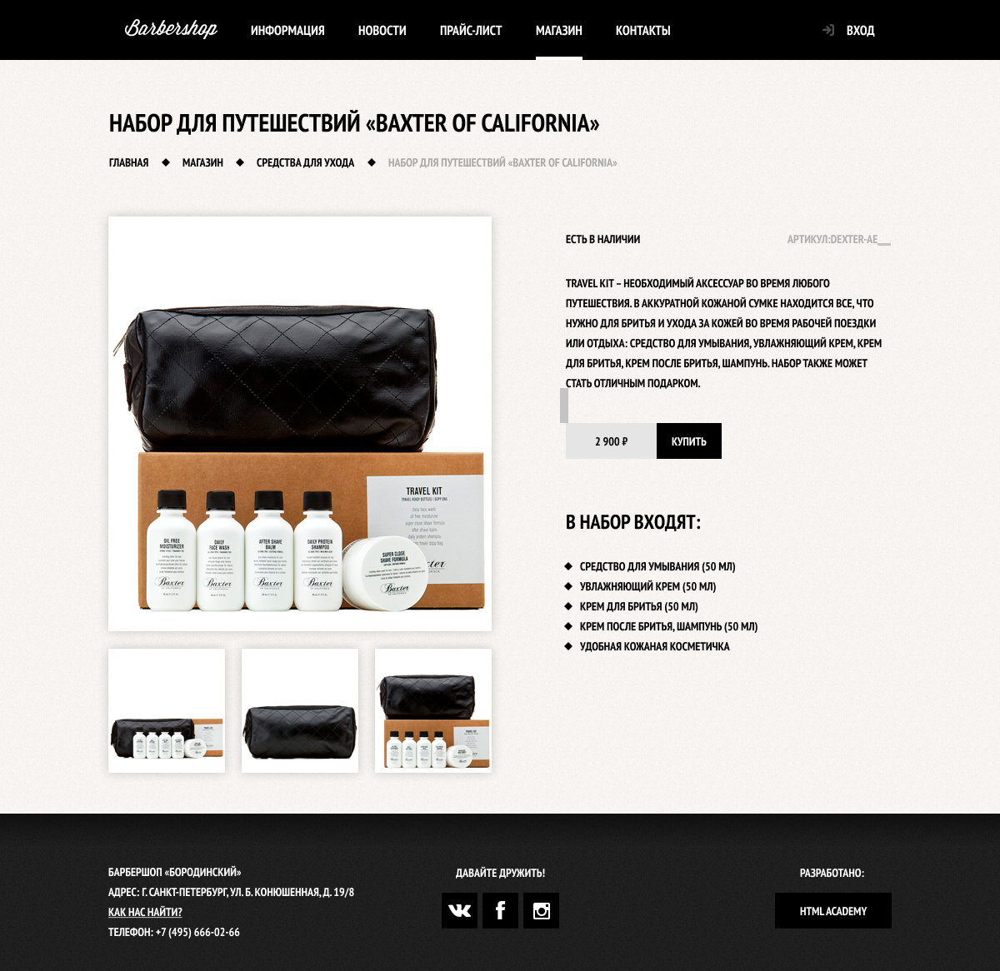
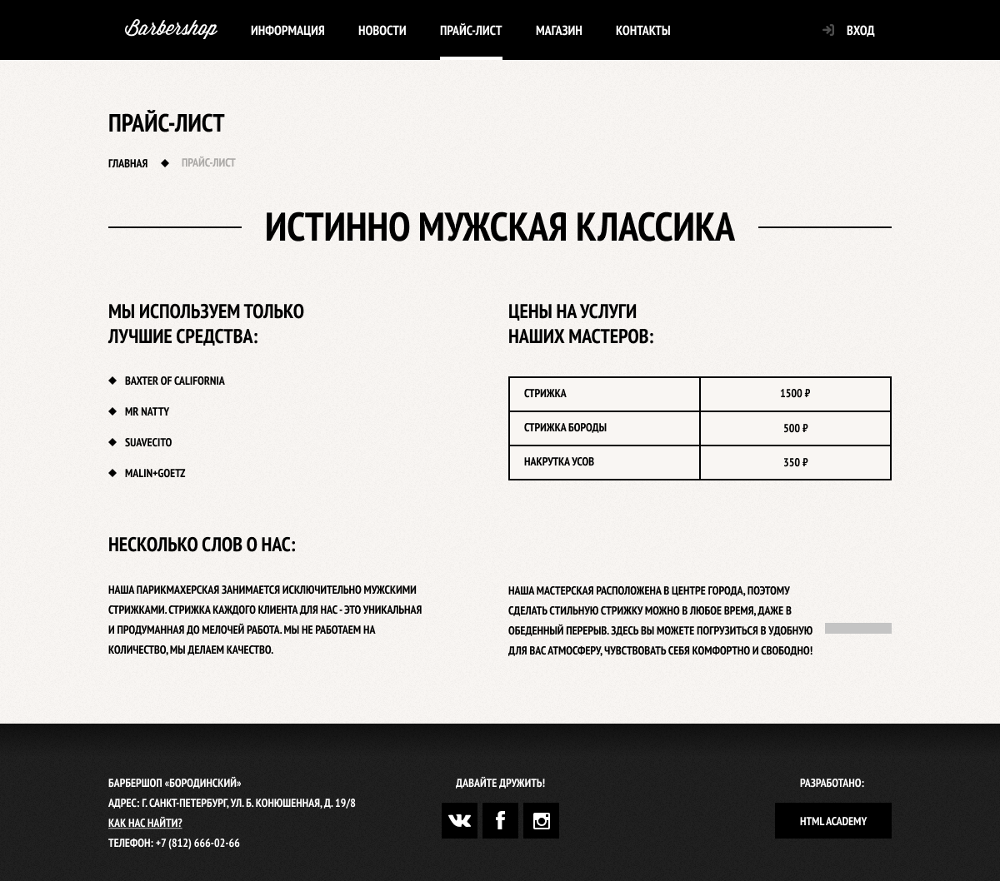

# Barbershop Borodinski

[Макет проекта в figma](https://www.figma.com/file/Uz3eILWGgNCKybYvNOV3VA/HTML-1-%D0%91%D0%B0%D1%80%D0%B1%D0%B5%D1%80%D1%88%D0%BE%D0%BF?node-id=0%3A1)

Используемые технологии:
- HTML5
- CSS3
- javascript
- CSS-паттерны
- прогрессивное улучшение
---
Навигация:
- клик по элементам **ВХОД** и **КАК ПРОЕХАТЬ** вызывает соответствующие попапы
- клик в **Главном меню** по элементу **ПРАЙС-ЛИСТ** переводит на страницу <price.html>
- клик в **Главном меню** по элементу **МАГАЗИН** переводит на страницу *shop.html*
- клик в *shop.html* по первой карточке товара переводит на *item.html*
- клик в элементе breadcrumbs по *ГЛАВНАЯ* переводит на *index.html*

